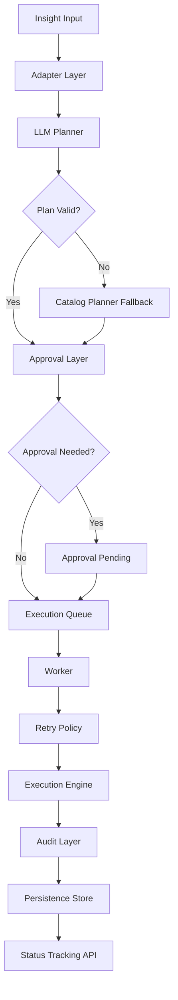

# Agentic ALM Framework

Agentic ALM Framework is a modular framework for turning analytical insights into governed, executable workflows. Instead of stopping at dashboards, alerts, or recommendations, this project focuses on the full action lifecycle: intake, planning, approval, execution, auditability, persistence, and deployment readiness.

## 🔥 Architecture Diagram



## Why this project exists
Many analytics systems are good at generating signals but weak at operationalizing them. This framework is designed to bridge that gap by introducing a controlled, extensible path from insight to action.

## What this framework does
- Accepts structured insight payloads from upstream systems
- Normalizes requests through an adapter layer
- Generates context-aware action plans
- Uses an LLM-style planner with a safe catalog fallback strategy
- Routes risky steps for approval
- Queues execution for asynchronous processing
- Applies retry logic for resiliency
- Tracks workflow state through persistence and status APIs
- Supports containerized deployment

## API endpoints
- `GET /health`
- `POST /process-insight`
- `GET /status/{correlation_id}`

## Run with Docker
```bash
docker-compose up --build
```

Open: http://localhost:8000/docs

## Tech stack
- Python
- FastAPI
- Pydantic
- Docker

## Summary
This project demonstrates a production-style backend system combining AI-assisted planning, async execution, workflow orchestration, and deployment readiness.
