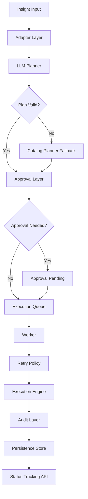

# Architecture Diagram

```mermaid
flowchart TD
    A[Insight Input] --> B[Adapter Layer]
    B --> C[LLM Planner]
    C --> D{Plan Valid?}
    D -- Yes --> E[Approval Layer]
    D -- No --> F[Catalog Planner Fallback]
    F --> E
    E --> G{Approval Needed?}
    G -- Yes --> H[Approval Pending]
    G -- No --> I[Execution Queue]
    H --> I
    I --> J[Worker]
    J --> K[Retry Policy]
    K --> L[Execution Engine]
    L --> M[Audit Layer]
    M --> N[Persistence Store]
    N --> O[Status Tracking API]
```
